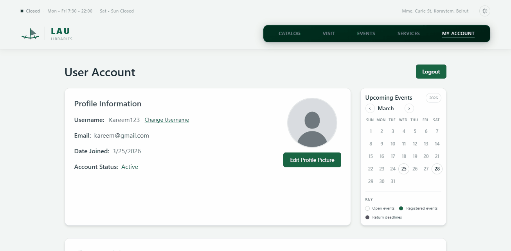
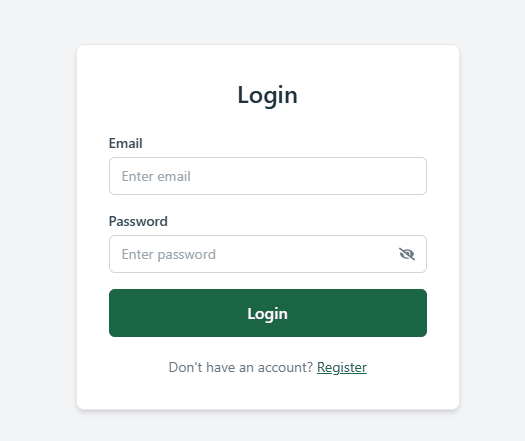
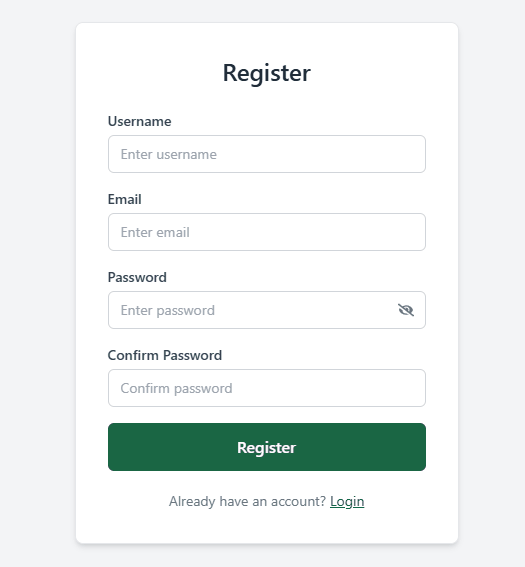

# LAU Riyad Nassar Library — Web Application

CSC443 · Spring 2026 · Project Phases 1 & 2 · Team Dodgers

A full-stack web application for the Lebanese American University's Riyad
Nassar Library. Phase 1 delivered a responsive React frontend; Phase 2
adds a Node.js/Express backend, a MySQL database, JWT-based
authentication, and authenticated CRUD endpoints — converting the
simulated frontend into a fully functional, persistent, secure
full-stack application.

---

## Team Members

Each member kept ownership of their Phase 1 surface and built the
backend that powers it. Phase 2 work was split into four roughly equal
pillars: authentication and user/loans data, public catalog APIs and
deployment, admin book CRUD, and frontend API consumption.

| Member | Phase 1 — Frontend | Phase 2 — Full-Stack |
|---|---|---|
| **Kareem Naous** | User Dashboard, Login, Register, Event Detail, Dark Mode | Authentication backend (`/api/auth/register`, `/api/auth/login`) with bcrypt password hashing and JWT issuance; `authMiddleware` protecting authenticated routes; user profile and loans APIs (`/api/users/me`, `/api/loans`, `/api/dashboard`); migrated the Dashboard from `localStorage` to backend-driven data. |
| **Perla Imad** | List View, Book Detail, Services, Responsive Design | Frontend API integration for Book Detail, List View, and Services; reviews and favorites endpoints powering Book Detail (`/api/reviews`, `/api/favorites`); loading, error, and success UI states across pages; responsive QA after replacing mock data with API calls. |
| **Kareem Hammoud** | Homepage, Events, Catalog | Public read APIs for books and events (`GET /api/books`, `GET /api/events`); MySQL schema design (`server/db/schema.sql`) and seed scripts for books and events; Homepage, Catalog, and Events frontend integration; deployment lead — backend on Render and frontend on Vercel, including environment configuration end-to-end. |
| **Rayan Madi** | Add Book, Edit Book, Author Detail | Authenticated book CRUD endpoints (`POST`, `PUT`, `DELETE /api/books`); request validation and admin-only authorization; Add/Edit Book form integration with the backend including image and rating handling. |

---

## Assigned Topic and Primary Data Entities

**Topic:** University Library Management System — LAU Riyad Nassar Library.

The full schema is in [`server/db/schema.sql`](server/db/schema.sql).
The four primary entities and their relationships:

- **Users** — `id`, `full_name`, `email` (unique), `password` (bcrypt
  hash), `created_at`. The owner of every authenticated action.
- **Books** — `id`, `title`, `author`, `genre`, `language`, `year`,
  `rating`, `pages`, `publisher`, `isbn`, `description`, `cover`,
  `available_copies`, `created_by` (FK → `users.id`), `created_at`.
- **Events** — `id`, `title`, `date`, `time`, `location`, `category`,
  `format`, `description`, `speaker`, `seats`, `registered`,
  `created_by` (FK → `users.id`), `created_at`.
- **Loans** — `id`, `user_id` (FK → `users.id`), `book_id` (FK →
  `books.id`), `borrow_date`, `due_date`, `return_date`, `renew_count`,
  `status`. One row per borrow event.

Supporting entities are also modeled as MySQL tables with foreign keys:
`reviews` (per-book ratings and comments), `favorites` (user-saved
books), `reservations` (holds for unavailable books),
`study_room_bookings` (group study-room reservations), `help_requests`
(Ask a Librarian messages), and `reading_progress` (per-user book
progress).

---

## Deployed Application

| Resource | URL |
|---|---|
| Frontend | https://library-1-tau.vercel.app |
| Backend API | https://library-api-46jn.onrender.com |
| GitHub | https://github.com/Kareemalhammoud/library-1 |

The backend is on Render's free tier and spins down after periods of
inactivity. The first request after a quiet period takes 30–60 seconds
while the instance wakes up; subsequent requests are fast.

---

## Local Setup

### Prerequisites

- Node.js v18 or newer
- npm v9 or newer
- MySQL v8 or newer

### Backend (terminal 1)

```bash
cd server
cp .env.example .env                    # then edit .env (see below)
npm install
mysql -u root -p -e "CREATE DATABASE IF NOT EXISTS lau_library;"
mysql -u root -p lau_library < db/schema.sql
npm run seed                            # populates books, events, sample reviews
npm run dev                             # API listens on http://localhost:5000
```

Minimum `server/.env` keys:

```
DB_HOST=localhost
DB_PORT=3306
DB_USER=root
DB_PASSWORD=
DB_NAME=lau_library
JWT_SECRET=any-long-random-string
PORT=5000
```

A more detailed walkthrough — including notes on connecting to a
managed cloud database — lives in
[`server/SETUP.md`](server/SETUP.md).

### Frontend (terminal 2)

From the repository root:

```bash
npm install --legacy-peer-deps          # peer conflict: Vite and Tailwind v4
npm run dev                             # frontend on http://localhost:5173
```

The frontend defaults to a backend at `http://localhost:5000` and needs
no `.env` for local development. To point at a different backend (e.g.
a deployed API), set `VITE_API_URL` (with the `/api` suffix) and
`VITE_API_BASE` (without).

### Admin Account

Two admin emails are recognized by default — `admin@lau.edu` and
`superadmin@lau.edu`. Register one of them after seeding to get an
admin account:

```bash
curl -X POST http://localhost:5000/api/auth/register \
  -H 'Content-Type: application/json' \
  -d '{"full_name":"LAU Admin","email":"admin@lau.edu","password":"Admin123!"}'
```

Then sign in at `/login`. Admins can add, edit, and delete books and
events from the UI.

The recognized list is configurable per environment via the
`ADMIN_EMAILS` (backend) and `VITE_ADMIN_EMAILS` (frontend)
comma-separated environment variables — no code changes needed to
rotate or add admins.

---

## API Documentation

Base URLs:

- **Production:** `https://library-api-46jn.onrender.com/api`
- **Local:** `http://localhost:5000/api` (or whatever `PORT` is set to
  in `server/.env`)

**Authentication.** Protected endpoints expect
`Authorization: Bearer <jwt>`. The token is issued by
`/api/auth/login` and `/api/auth/register` and is stored by the
frontend in `localStorage` under the key `token`.

**Errors.** Failures return JSON of shape `{ "message": "..." }` with
an HTTP status that matches the cause: `400` invalid input, `401`
unauthenticated, `403` forbidden, `404` not found, `409` conflict, and
`500` for unexpected server errors.

### Auth

| Method | Path | Auth | Description |
|---|---|---|---|
| POST | `/api/auth/register` | — | Create a user. Body: `{ full_name, email, password }`. Returns the user and a JWT. 400 on missing fields or duplicate email. |
| POST | `/api/auth/login` | — | Authenticate. Body: `{ email, password }`. Returns the user and a JWT. 401 on bad credentials. |

Response shape for both endpoints:

```json
{
  "message": "Login successful",
  "token": "eyJhbGciOi...",
  "user": {
    "id": 7,
    "full_name": "Karim Hammoud",
    "email": "karim@example.com",
    "createdAt": "2026-04-25T18:00:00.000Z"
  }
}
```

### Users

| Method | Path | Auth | Description |
|---|---|---|---|
| GET | `/api/users/me` | ✅ | Returns the currently authenticated user. 401 if the JWT is missing or invalid. |

### Books

| Method | Path | Auth | Description |
|---|---|---|---|
| GET | `/api/books` | — | List all books. Optional query params: `search`, `genre`, `language`, `limit`. |
| GET | `/api/books/:id` | — | Single book by id. 404 if not found. |
| POST | `/api/books/:id/borrow` | ✅ | Borrow through Book Detail. Uses the same loan rules as `/api/loans`. |
| POST | `/api/books/:id/reserve` | ✅ | Reserve an unavailable book. 409 if copies are available or the user already has an active loan/reservation. |
| POST | `/api/books` | 🛡️ admin | Create a book. Required body: `title`, `author`. Optional: `genre`, `language`, `year`, `pages`, `rating`, `publisher`, `isbn`, `description`, `cover`, `availableCopies`. |
| PUT | `/api/books/:id` | 🛡️ admin | Update a book. Same body shape as `POST`. |
| DELETE | `/api/books/:id` | 🛡️ admin | Delete a book. |

Book response shape:

```json
{
  "id": 0,
  "title": "The Story of Art",
  "author": "E.H. Gombrich",
  "genre": "Art",
  "language": "EN",
  "year": 1950,
  "rating": 4.5,
  "pages": 688,
  "publisher": "Phaidon Press",
  "isbn": "978-0-7148-3247-0",
  "description": "...",
  "cover": "https://.../cover.jpg",
  "copies": 3
}
```

### Events

| Method | Path | Auth | Description |
|---|---|---|---|
| GET | `/api/events` | — | List events. Optional query params: `category`, `format`, `month` (1–12), `search`, `featured=true`. Sorted by date ascending. |
| GET | `/api/events/:id` | — | Single event by id. |
| POST | `/api/events` | 🛡️ admin | Create an event. Required body: `title`, `date` (`YYYY-MM-DD`). Optional: `time`, `location`, `category`, `format`, `featured`, `image`, `description`, `speaker`, `seats`, `registered`. |
| PUT | `/api/events/:id` | 🛡️ admin | Update an event. |
| DELETE | `/api/events/:id` | 🛡️ admin | Delete an event. |

Event response shape:

```json
{
  "id": 1,
  "title": "Research Skills Workshop",
  "date": "2026-03-25",
  "time": "2:00 PM - 4:00 PM",
  "location": "Riyad Nassar Library, Beirut",
  "category": "Workshops",
  "format": "In-Person",
  "speaker": "Dr. Nada El-Husseini",
  "seats": 30,
  "registered": 22,
  "createdBy": null,
  "createdAt": "2026-04-21T18:00:00.000Z"
}
```

### Loans

| Method | Path | Auth | Description |
|---|---|---|---|
| GET | `/api/loans` | ✅ | Active (un-returned) loans for the current user. |
| POST | `/api/loans` | ✅ | Borrow a book. Body: `{ "bookId": 0 }`. Issues a 14-day loan. 404 if the book doesn't exist; **409** if you already have an active loan or no copies are available. |
| POST | `/api/loans/:id/return` | ✅ | Return one of your active loans and restore one available copy without exceeding `total_copies`. |
| POST | `/api/loans/reservations` | ✅ | Reserve an unavailable book. Body: `{ "bookId": 0 }`. |

Loan response shape:

```json
{
  "id": 12,
  "book_id": 0,
  "title": "The Story of Art",
  "author": "E.H. Gombrich",
  "borrow_date": "2026-04-26",
  "due_date":    "2026-05-10",
  "return_date": null,
  "renew_count": 0,
  "status": "active"
}
```

### Favorites

| Method | Path | Auth | Description |
|---|---|---|---|
| GET | `/api/favorites` | ✅ | List the current user's favorite books. |
| POST | `/api/favorites/:bookId` | ✅ | Add a book to favorites. Idempotent. |
| DELETE | `/api/favorites/:bookId` | ✅ | Remove a book from favorites. |

### Reviews

| Method | Path | Auth | Description |
|---|---|---|---|
| GET | `/api/reviews/book/:bookId` | — | Reviews for a book, newest first. |
| POST | `/api/reviews/book/:bookId` | ✅ | Submit (or update) a review. Body: `{ "rating": 1-5, "comment": "..." }`. One review per user per book. |
| DELETE | `/api/reviews/:id` | ✅ | Delete your own review. 403 if it isn't yours. |

### Dashboard

| Method | Path | Auth | Description |
|---|---|---|---|
| GET | `/api/dashboard` | ✅ | Aggregated view for the logged-in user — active loans, history, overdue, and renewals — in a single payload. |

### Reading Progress

| Method | Path | Auth | Description |
|---|---|---|---|
| GET | `/api/reading-progress/:bookId` | ✅ | Return the current user's saved progress for one book. Defaults to `0` if no row exists. |
| PUT | `/api/reading-progress/:bookId` | ✅ | Save progress for one book. Body: `{ "progress": 0-100 }`. Values are rounded and clamped server-side. |

### Services

| Method | Path | Auth | Description |
|---|---|---|---|
| GET | `/api/study-room-bookings/availability` | — | Public time-slot availability for a room/date. Query: `campus`, `room`, `date`. Returns five slots (`08:00`, `10:00`, `12:00`, `14:00`, `16:00`) with `available` flags. |
| POST | `/api/study-room-bookings` | — | Create a study-room booking. Body: `{ campus, room, date, duration, time, people, studentId, notes? }`. Validates room/campus matching, duration, slot, group size, LAU ID, and rejects duplicate active slots with `409`. |
| GET | `/api/study-room-bookings` | 🛡️ admin | List study-room bookings for admin review. |
| PATCH | `/api/study-room-bookings/:id/status` | 🛡️ admin | Update booking status to `pending`, `confirmed`, or `cancelled`. |
| POST | `/api/help-requests` | — | Create a librarian/help request. Body: `{ message, name?, email? }`. |
| GET | `/api/help-requests` | 🛡️ admin | List help requests for admin review. |
| PATCH | `/api/help-requests/:id/status` | 🛡️ admin | Update help request status to `open`, `in_progress`, or `resolved`. |

Study-room bookings are fully custom now: `/services/studyrooms` no
longer links to LAU LibCal. The page uses the app's own room selector,
date picker, live slot availability, booking form, and MySQL-backed
conflict checks. LAU IDs must be 8 or 9 digits, with no spaces or
dashes. Compatibility aliases are also available under
`/api/services/study-rooms`.

### Authorization Model

- **Books and events** are the library's curated catalog: `POST`,
  `PUT`, and `DELETE` are restricted to admin accounts.
- **Per-user resources** (loans, favorites, reviews) are scoped to the
  authenticated user — each user can only modify their own.
- **Reads** on books and events are public; reads on per-user
  resources require authentication.

The check is implemented as an `adminOnly` middleware that runs after
`authMiddleware` and rejects any user whose email is not in
`ADMIN_EMAILS`. An interactive Swagger UI is also available at
`/api-docs` on the deployed backend.

---

## GIFs

> The GIFs below showcase the final, deployed application.

### Homepage (`/`)


### Book Catalog (`/catalog`)


### Book List (`/books`)


### Book Detail (`/books/:id`)


### Add / Edit Book (`/books/add`, `/books/:id/edit`) — admin only


### Events (`/events`)


### Services (`/services`)


### Visit (`/visit`)


### User Dashboard (`/dashboard`)



### Login & Register (`/login`, `/register`)

 

### Dark Mode


---

## Technical Challenges and How We Solved Them

### Connecting to a managed cloud database

The backend runs on Render and the MySQL database on Railway. Wiring
them together exposed three issues:

1. **Port collision on macOS.** Apple's AirPlay Receiver listens on
   `:5000` on recent macOS releases, so `app.listen(5000)` silently
   exits. We made the port configurable via `PORT` in `server/.env` so
   anyone hitting this can switch ports without touching code.
2. **Managed-DB connection requires more config than local.** Railway's
   MySQL proxy uses a non-3306 port and benefits from SSL. We extended
   `server/config/db.js` to read `DB_PORT` and an optional
   `DB_SSL=true`, gated so local dev still works without SSL.
3. **Applying schema and seed against the cloud DB.** We wrote
   `server/scripts/apply-schema.js` and
   `server/scripts/migrate-add-copies.js` so schema changes can be
   applied idempotently against any environment without dropping data.

### "Fully Borrowed" on every book

Phase 1's seed data had no `copies` field, so the Phase 2 schema
didn't get one either. The catalog rendered every book as "fully
borrowed" because `book.copies ?? 0` was always `0`. We added
`available_copies INT NOT NULL DEFAULT 3` to the schema, aliased it to
`copies` in the API response so the frontend could keep its short
name, and ran an idempotent migration to backfill the live database
without re-seeding.

### Borrowed state stuck on Book Detail

Book Detail also had a localStorage fallback from the prototype era.
That made stale browser keys look like real active loans, so books could
appear as "Borrowed" even when `/api/loans` had no matching row. The
borrowed button state now comes from the authenticated user's active
loans, and `POST /api/books/:id/borrow` remains the source of truth for
creating the loan and decrementing inventory.

### Custom study-room booking instead of external LibCal

The original Study Rooms page linked to LAU's external LibCal pages. We
replaced that with an in-app booking flow backed by
`study_room_bookings`: users select campus, room, date, visible time
slot, duration, group size, and LAU ID. The backend exposes an
availability endpoint so already-booked slots are disabled before
submit, and the create endpoint still enforces the same conflict rule
with a `409`.

### Reading progress persistence

Reading progress started as a purely local slider. We added the
`reading_progress` table plus `GET`/`PUT /api/reading-progress/:bookId`
so signed-in users can keep progress per book across sessions and
devices. The frontend still keeps a local fallback if the network save
fails.

### Frontend pages reading the wrong field names

A subtler version of the same bug: `BookDetail`, `ListView`, and
`Home` were reading `data.available_copies`, `data.image`, and
`data.category` while the API returns `copies`, `cover`, and `genre`.
`BookDetail` even defined a `normalizeBook()` helper that did the
correct mapping but was never called — `setBook(rawApiPayload)` stored
the raw response. The fix was to actually invoke `normalizeBook` and
extend its fallback chains so legacy payload shapes still work.

### Vercel SPA 404s on deep routes

Vercel returns its own 404 for any URL without a matching file. React
Router handles `/catalog`, `/books/0`, etc. client-side, so a refresh
or shared link 404'd before reaching the SPA. Adding a `vercel.json`
that rewrites `/(.*)` to `/index.html` lets the router take over.

### Render env-var name typo causing ECONNREFUSED

When the backend first deployed, `/api/books` returned a generic 500.
The Render logs showed `code: 'ECONNREFUSED'` with no other context — a
classic "default to localhost:3306" failure. Cause: the Render env
tab had `DB-HOST` (hyphen) instead of `DB_HOST` (underscore), so
`process.env.DB_HOST` was `undefined`. Lesson: when debugging
deployments, read the actual logs first.

### Safari ignoring the SVG favicon

Safari has spotty SVG-favicon support, so the tab icon was blank in
Safari. We generated a 64×64 PNG (entirely with Python `struct` +
`zlib`, no image libraries) and declared it in `index.html` before
the SVG so Safari picks the PNG and other browsers still get the SVG.
